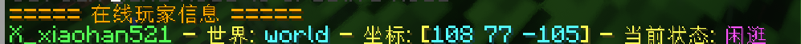
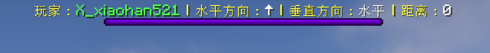

# 🧭 PlayerTracker Plugin（Capable for Spigot/Paper 1.13.x ~ 1.21.x）

🌐 [English](./README.md) | [CN 中文](./README_zh-CN.md)

🚀 **PlayerTracker** is a lightweight **Minecraft 1.13.x ~ 1.21.x server plugin** that allows administrators to **track the coordinates and status of online players**.


📌 **Latest Version: `v3.3.2`**  
📌 **Supported Minecraft Versions: `1.13.x ~ 1.21.x`**  
📌 **Compatible Servers: `Spigot` `Paper`**

---

## 📥 Quick Start
### 1️⃣ Download
🔹 [Click here to download **PlayerTracker**.](https://github.com/X-xiaohan521/PlayerTracker/releases/)

### 2️⃣ Installation
1. Download the `.jar` file.
2. Put the `.jar` file in the `.\plugins` folder of your Minecraft server.
3. Stop and restart your server.
4. Try `/playertracker` or `/pt` in game.

---

## 📝 How to Use
### 🔹 Main Commands
> 🚀 Both `/playertracker` and `/pt` work as valid command prefixes. For convenience, the examples below use `/pt`.

| Command            | Description               | Permission Required       |
|-----------------|-----------------------|-----------|
| `/pt track`    | Display the coordinary and status of all players online.    | `playertracker.use` |
| `/pt track <player>` | Display the coordinary and status of the player specified.  | `playertracker.use` |
| `/pt log <on/off>` | Enable/Disable logging. | `playertracker.admin` |
| `/pt log schedule <int>` | Set logging interval to [int] second. Default: 300 | `playertracker.admin` |
| `/pt reload` | Reload the config file. | `playertracker.admin` |
| `/pt viewer add/remove <player>` | Add/Remove the tracker pointed to the player specified. | `playertracker.view` |

> ❗ It is **highly recommended** to use PlayerTracker with a **permission control plugin** (such as `LuckPerms`, [click here for more information](https://luckperms.net/wiki/Home)) for a **more precise permission control** than the "OP" by default in Minecraft.

### 🔹 Feature Details
1. #### Basic Tracking `/pt track`
    When a **players with `playertracker.use` permission** or **server console** issue `/pt track` command, it displays all online players' coordinates and status in chat, for example:
    ```log
    ===== Online Players =====
    X_xiaohan521 - World: world - Position: [108 77 -105] - Status: Wandering
    Go_Karoo - World: world - Position: [247 62 -335] - Status: On Vehicle
    ```
    
    > 🚀 Players in game can click the coordinates in chat to **copy to clipboard**.
    
    To query a specific player, use `/pt track <player>`.
2. #### Logging
    When logging is enabled, player activities are automatically logged at `.\plugins\PlayerTracker\player_activities.log`. Refer to ["File Syntax"]() for an explanation of the logging syntax.
    
    **Players with `playertracker.admin` permission** or **server console** can toggle logging via `/pt log on/off`.
3. #### Live Tracker `/pt viewer`
    **Players with `playertracker.view` permission** can issue `/pt viewer add <player>` in game to display real-time tracking info on-screen, for example:
    
    ```log
    Tracking: X_xiaohan521 - World: world - Position: [96 72 34] - Status: Wandering
    ```
    
    To stop tracking, use `/pt viewer remove`.
    
    Additionally, the **BossBar area** (on top of the screen) will show the relative direction and distance between the viewer and the target:
    

    - Horizontal Direction: `↑` `↗` `→` `↘` `↓` `↙` `←` `↖` (8 total)
    - Vertical Direction: `↑` `↓` `Level` (3 total)
    - Distance: the straight-line distance between both players
    
    > ❗ Note: Only **one target** can be tracked at a time. Adding a new one replaces the previous target.

    > 💡 Heads-up: The viewer **uses the `ActionBar`** (the display area above palyers' hotbar). It may conflict with other plugins that also use the ActionBar.

---

## 📄 File Syntax
### 🔹 Configuration File `config.yml`
> 📌 Automatically generated at `.\plugins\PlayerTracker` on first launch.
```yml
plugin:
  enabled: true   # Enable/Disable the plugin

log:
  enabled: true   # Enable/Disable logging
  schedule: 300   # Logging interval (seconds)
```

### 🔹 Log File `player_activities.log`
> 📌 Automatically created at `.\plugins\PlayerTracker` when the first log entry is written.
1. #### Sample Log Entry
    ```log
    [2025-06-23 23:25:08] [X_xiaohan521] [world] [108 79 -90] [Joined Game]
    ```
   Format: `[Time]` `[Player]` `[World]` `[Coordinates]` `[Event]`

2. #### Log Triggers (when logging is enabled)
    a. Scheduled Logging
    > 📌 The plugin records all online players' status at intervals defined in `config.yml`. Possible status include:
    - Sleeping
    - On Vehicle
    - Swimming
    - Gliding
    - Sprinting
    - Sneaking
    - Wandering
  
    b. Specific Events
    > 📌 The following events automatically trigger logging:
    - Player join/quit
    - Player death
    - Flight toggle
    - Vehicle enter/exit
    - Player damage
    - Ender pearl usage
    - Player attack
    - Chet opening

---

## 🛠️ Technical Overview
### Plugin Structure
```less
src/
└── main/
    └── java/
        └── unimilk/
            └── playertracker/
                ├── PlayerTracker.java                 // Main Class
                ├── command/
                │   ├── CommandHandler.java              // Command Handler
                │   └── CommandTabCompleter.java       // Tab Completer
                ├── viewer/
                │   ├── TrackViewer.java               // Track Manager
                │   └── BossBarManager.java            // BossBar Manager
                ├── log/
                │   └── ActivityLogger.java            // Logging System
                └── util/
                    ├── PlayerStatusUtils.java         // Player Status Utility
                    ├── DirectionDistanceCalc.java    // Direction & Distance Calculator
                    └── EventListener.java            // Event Listener

```
### Data Structure
```text
  Time
  Name
  Location
  ├── world
  └──coordinary
  Activity
  ├──status
  └──event

  Direction
  Distance
```

---

## 🔧 FAQ
- ### Q: Will the viewer be kept after a player quit?
  #### A: If it is the player who created the viewer quit, the viewer won't be kept, and you would have to re-add the viewer after rejoin. But if it is the target quit, the viewer will be reactivated once the target rejoin.
- ### Q: Does the log file clean itself regularly?
  #### A: Not yet. You need to clear it manually. Auto-clean is planned for future versions.
- ### Q: How often does the viewer refresh?
  #### A: It updates only when either the tracker or target moves.
- ### Q: Will other game versions be supported?
  #### A: Yes, support for more versions is planned.

---

## 📜 Changelog
> 📌 Only the latest version is listed here. See `CHANGELOG.md` for older versions.
### [3.3.2] - 2025-10-08

### 🌟 Improvements
- Added compatibility for Minecraft `1.13.x ~ 1.21.x`.

### 🛠 Bugfixes
- Fixed plugin loading issues on servers of `1.13.x~1.18.x`.

---

## 💡 Contributing
### Want to help improve this plugin? Submit an **Issue** or **Pull Request** via GitHub.
- Report issues: [🔗 GitHub Issues](https://github.com/X-xiaohan521/PlayerTracker/issues)
- Suggest new features: [🔗 GitHub Issues](https://github.com/X-xiaohan521/PlayerTracker/issues)
- Join discussions: [🔗 Github discussions](https://github.com/X-xiaohan521/PlayerTracker/discussions/)
- Contribute code: Fork and submit a [🔗 Pull Request](https://github.com/X-xiaohan521/PlayerTracker/pulls)

---

## 📜 License
### This plugin is released under the **Unlicense**.
Anyone is free to copy, modify, publish, use, compile, sell, or
distribute this software, either in source code form or as a compiled
binary, for any purpose, commercial or non-commercial, and by any
means.

---

## 📞 Contact Me
### 📧 Email: unimilk891@gmail.com
### 🌐 GitHub: [X-xiaohan521](https://github.com/X-xiaohan521/)

---

## 📌 Final Words
### Thank you for using **PlayerTracker**!
If you find this plugin helpful, please star ⭐ ths repository or leave your feedback — your support means a lot to me! 🚀