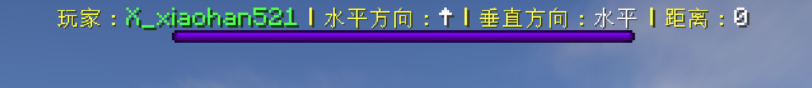

# 🧭 PlayerTracker 插件（适用于 Spigot/Paper 1.19.1）
🚀 **PlayerTracker** 是一款 **Minecraft 1.19.1** 服务器插件，支持管理员查询在线玩家 **坐标和状态**.

🚀 **PlayerTracker** is an esay-to-use plugin for **1.19.1 Minecraft servers**. Server ops are able to get to know **the coordinary and status** of online players.

📌 **当前版本：`v3.3.1`**  
📌 **兼容 Minecraft 版本：`1.19.1`**  
📌 **支持服务端：`Spigot` `Paper`**

---

## 📥 下载 & 安装
### 1️⃣ 下载插件
🔹 [点击下载 PlayerTracker](https://github.com/X-xiaohan521/PlayerTracker/releases/)

### 2️⃣ 安装步骤
1. **下载** `.jar` 文件。
2. 将插件文件放入服务器的 `plugins` 文件夹。
3. 重启服务器。
4. 在游戏内使用 `/playertracker` 或 `/pt` 命令进行测试。

---

## 📝 使用方法
### 🔹 主要指令
> 🚀 `/playertracker` 或 `/pt` 均为合法命令前缀，为方便输入，以下均采用 `/pt` 作为例子

| 指令            | 功能描述               | 权限       |
|-----------------|-----------------------|-----------|
| `/pt track`    | 查询所有在线玩家坐标及状态    | `playertracker.use` |
| `/pt track <player>` | 查询指定玩家坐标及状态  | `playertracker.use` |
| `/pt log <on/off>` | 开启/关闭日志记录  | `playertracker.admin` |
| `/pt log schedule <int>` | 调整日志记录间隔（秒），默认为 300  | `playertracker.admin` |
| `/pt reload` | 重载配置文件 | `playertracker.admin` |
| `/pt viewer add/remove <player>` | 添加/删除对指定玩家的追踪器 | `playertracker.view` |

### 🔹 功能解释
1. #### 基础功能 `/pt track`
    当 **具有 `playertracker.use` 权限的玩家** 或 **服务器控制台** 输入 `/pt track` 命令后，将会在聊天栏返回当前服务器所有在线玩家的信息，示例如下：
    ```log
    ===== 在线玩家信息 =====
    X_xiaohan521 - 世界: world - 坐标: [108 77 -105] - 当前状态: 闲逛
    Go_Karoo - 世界: world - 坐标：[247 62 -335] - 当前状态: 乘坐载具
    ```
    
    > 🚀 游戏内玩家可用鼠标 **点击聊天栏坐标快速复制**
    
    若想要查询特定玩家，可在 `/pt track` 后加上玩家名，即 `/pt track <player>` 即可。
2. #### 日志记录
    当日志功能被启用时，日志将自动记录在 `.\plugins\PlayerTracker\player_activities.log` 中。日志格式详见“文件解释”。
    
    **具有 `playertracker.admin` 权限的玩家** 或 **服务器控制台** 输入 `/pt log on/off` 可快捷开启或关闭日志记录功能。
3. #### 追踪器 `/pt viewer`
    **具有 `playertracker.view` 权限的玩家** 可在游戏内使用 `/pt viewer add <player>` 来添加追踪器，将指定玩家的信息实时固定显示在游戏画面上，示例如下：
    
    显示格式为：
    ```log
    正在追踪：X_xiaohan521 - 世界: world - 坐标: [96 72 34] - 当前状态: 闲逛
    ```
    
    使用 `/pt viewer remove` 来停止追踪当前玩家。
    
    同时，屏幕上方 **Boss血量条的位置** 会显示追踪对象与追踪者之间的相对位置关系，显示格式如下：
    

    其中：
    - “水平方向” 有 `↑` `↗` `→` `↘` `↓` `↙` `←` `↖`（共8种），表示追踪对象相对追踪者视角的水平方向；
    - “垂直方向” 有 `↑` `↓` `水平`（共3种），表示追踪对象与追踪者的相对高度关系；
    - “距离” 是追踪对象与追踪者之间的直线距离
    
    > ❗ 注意：暂不支持添加多个追踪对象，当已有一个正在追踪玩家时，再次添加追踪玩家会覆盖之前的追踪。

    > 💡 此外：追踪器需要占用 `ActionBar` ，即玩家物品栏上方的显示区域，故与其他需要使用 `ActionBar` 显示信息的插件不兼容，请完全卸载其他此类插件后再安装。

---

## 📄 文件解释
### 🔹 配置文件 `config.yml`
> 📌配置文件会在插件首次启动时自动生成在 `.\plugins\PlayerTracker` 路径下
```yml
plugin:
  enabled: true   #控制插件开启/关闭

log:
  enabled: true   #控制日志记录开启/关闭
  schedule: 300   #控制日志自动记录间隔（秒）
```

### 🔹 日志文件 `player_activities.log`
> 📌日志文件会在首次有事件被记录时自动创建在 `.\plugins\PlayerTracker` 路径下
1. #### 日志记录样例
    ```log
    [2025-06-23 23:25:08] [X_xiaohan521] [world] [108 79 -90] [加入游戏]
    ```
    从左至右依次是 `[时间]` `[玩家名]` `[世界名]` `[坐标]` `[事件]`

2. #### 日志记录触发条件（当日志开启时）
    a. 定时记录
    > 📌从插件启动开始，按照 `config.yml` 中设置的时间间隔定时对服务器内所有在线玩家状态进行记录。可被记录的状态如下：
    - 睡觉中
    - 乘坐载具
    - 游泳
    - 滑翔中
    - 疾跑
    - 潜行
    - 闲逛
  
    b. 事件自动触发
    > 📌以下事件发生时，将会自动记录触发事件的相应玩家
    - 玩家进入/离开游戏
    - 玩家死亡
    - 玩家切换飞行状态
    - 玩家进入/退出载具
    - 玩家受伤
    - 玩家使用末影珍珠
    - 玩家攻击
    - 玩家打开箱子

---

## 🛠️ 技术规范
### 插件架构
```less
src/
└── main/
    └── java/
        └── unimilk/
            └── playertracker/
                ├── PlayerTracker.java                 // 主类
                ├── command/
                │   ├── CommandHandler.java              // 命令处理器
                │   └── CommandTabCompleter.java       // 命令补全器
                ├── viewer/
                │   ├── TrackViewer.java               // 追踪器
                │   └── BossBarManager.java            // BossBar管理器
                ├── log/
                │   └── ActivityLogger.java            // 日志记录器
                └── util/
                    ├── PlayerStatusUtils.java         // 获取玩家状态工具
                    ├── DirectionDistanceCalc.java    // 方向/距离计算工具
                    └── EventListener.java            // 事件监听器

```
### 插件数据结构
```text
  Time
  Name
  Location
  ├── world
  └──coordinary
  Activity
  ├──status
  └──event

  Direction
  Distance
```

---

## 🔧 常见问题 Q&A
- ### Q: 追踪器在玩家退出游戏后是否还会保留？
  #### A：不会，重新进入游戏后需要重新添加追踪器。
- ### Q：日志是否会定期自动清理？
  #### A：目前不会，需要手动清理，后续会开发相关功能。
- ### Q：追踪器的刷新频率是多少？
  #### A：没有固定刷新频率，只会在玩家（追踪者或追踪对象）有移动时更新相应的追踪器。
- ### Q：是否会支持其他游戏版本？
  #### A：有计划会支持，敬请期待~

---

## 📜 更新日志
> 📌此处只显示最新版本，更早版本详见 `CHANGELOG.md`
### [3.3.1] - 2025-07-18

### 🌟 优化
- 允许使用指令修改日志记录间隔

### 🛠 修复
- 更新了插件架构说明

---

## 💡 参与贡献
### 如果你想帮助改进这个插件，请通过 GitHub 提交 Issue 或 Pull Request。
- 提交问题：[🔗 GitHub Issues](https://github.com/X-xiaohan521/PlayerTracker/issues)
- 提交功能建议: [🔗 GitHub Issues](https://github.com/X-xiaohan521/PlayerTracker/issues)
- 插件讨论：[🔗 discussions](https://github.com/X-xiaohan521/PlayerTracker/discussions/)
- 提交代码：Fork 代码仓库并发起 [🔗 Pull Request](https://github.com/X-xiaohan521/PlayerTracker/pulls)

---

## 📜 许可证
### 本插件基于 Unlicense 开源发布。
任何人都可以以及任何途径自由复制、修改、发布、使用、编译、出售或以源代码形式或编译后的形式分发此软件，并用于任何目的（商业或非商业）。

---

## 📞 联系方式
### 📧 Email: unimilk891@gmail.com
### 🌐 GitHub: [X-xiaohan521](https://github.com/X-xiaohan521/)

---

## 📌 结语
### 感谢使用 PlayerTracker！如果你觉得插件好用，请 Star ⭐ 这个 GitHub 项目，或在评论区留言反馈！🚀